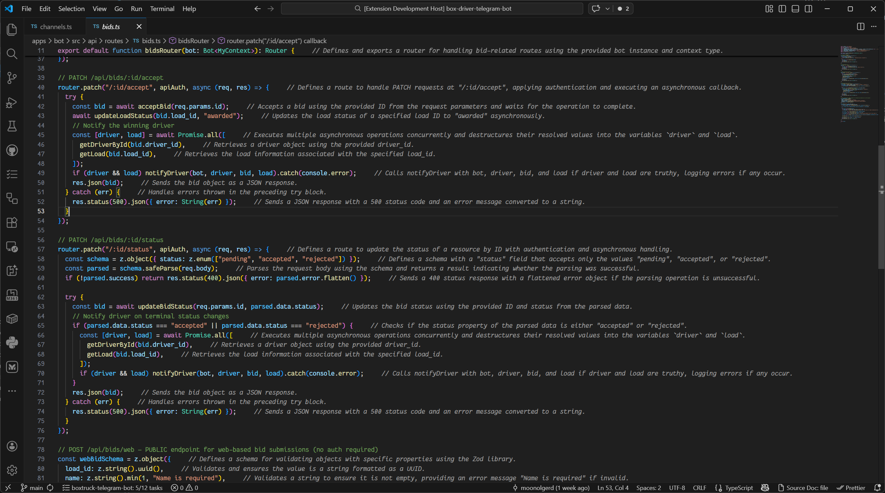
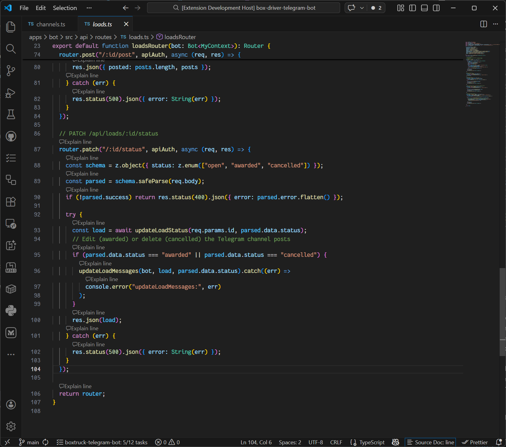

# Source Doc

A VS Code extension that explains source code **line-by-line, block-by-block, or all at once** via CodeLens markers, powered by **GitHub Copilot**.





---

## Features

- **CodeLens markers** appear above every function, class, method (block mode), every non-empty line (line mode), or just a single file-level lens (file mode).
- Click a lens to get a concise, one-sentence **AI explanation** generated by GitHub Copilot — no API key required.
- **Explain file** — explain every non-noise line in the current file with a single click; requests run with a concurrency limit (max 5 at a time) to stay within Copilot API limits.
- Explanations render as **inline ghost text** (italic comment) directly after the target line and **persist when switching between tabs**.
- Hover over truncated ghost text to see the full explanation in a tooltip.
- **Toggle mode** between `block`, `line`, `both`, `file`, and `none` via the status bar or command palette.
- **Generated files are skipped** — no lenses on `*.d.ts`, `*.g.cs`, `*.min.js`, etc.
- **LRU cache** — repeated requests for the same code never hit the API twice.
- Supports **TypeScript, TSX, JavaScript, JSX, C#, XAML, Python, Java, Go, Kotlin, Dart, Swift, Rust, C, and C++** out of the box — add any VS Code language ID via `sourceDoc.languages`.

---

## Requirements

- VS Code **1.90** or newer
- [GitHub Copilot](https://marketplace.visualstudio.com/items?itemName=GitHub.copilot) extension installed and signed in

---

## Getting Started

1. **Clone / open** this folder in VS Code.
2. Run `npm install` then press **F5** to launch the Extension Development Host.
3. Open any supported file (`.ts`, `.tsx`, `.js`, `.jsx`, `.cs`, `.xaml`, `.py`, `.java`, `.go`, `.kt`, `.dart`, `.swift`, `.rs`, `.c`, `.cpp`, …).
4. CodeLens markers appear above each block — click **`$(comment) Explain block`**, **`$(comment) Explain line`**, or **`$(comment) Explain file`**.
5. Ghost text with the explanation appears at the end of the line.

---

## Commands

| Command | Description |
|---|---|
| `Source Doc: Explain Block` | Explain the function / class under the lens |
| `Source Doc: Explain Line` | Explain a single line |
| `Source Doc: Explain File (all lines)` | Explain every non-noise line in the file in parallel |
| `Source Doc: Toggle Mode` | Cycle through `block → line → both → file → none` |
| `Source Doc: Clear All Explanations` | Remove all ghost text from the active workspace |
| `Source Doc: Refresh CodeLenses` | Force a full refresh of all CodeLens markers |

---

## Settings

| Setting | Type | Default | Description |
|---|---|---|---|
| `sourceDoc.enabled` | `boolean` | `true` | Enable or disable all CodeLens markers |
| `sourceDoc.mode` | `"block"` \| `"line"` \| `"both"` \| `"file"` \| `"none"` | `"block"` | Granularity of CodeLens markers |
| `sourceDoc.languages` | `string[]` | `["typescript","typescriptreact","javascript","javascriptreact","csharp","xaml","python","java","go","kotlin","dart","swift","rust","c","cpp"]` | Language IDs to activate on |
| `sourceDoc.modelFamily` | `string` | `"gpt-4o"` | GitHub Copilot model family to use |
| `sourceDoc.maxExplanationLength` | `number` | `160` | Max characters of ghost text (40–400) |

### Modes

| Mode | Behaviour |
|---|---|
| `block` | One lens per function / class / method (default) |
| `line` | One lens per non-noise line |
| `both` | Both block-level and line-level lenses |
| `file` | Only the `$(comment) Explain file` lens at the top of the file |
| `none` | No lenses at all |

---

## How It Works

```
Open file
   │
   ▼
CodeLensProvider.provideCodeLenses()
   │  isGeneratedFile() → skip *.d.ts, *.g.cs, *.min.js …
   │  mode === 'none'   → return []
   │
   ├─ always: file-level "Explain file" lens at line 0
   ├─ block mode → executeDocumentSymbolProvider (LS symbols)
   │               └─ fallback: regex detection + retry in 2.5 s
   └─ line mode  → iterate non-noise lines
   │
   ▼
User clicks lens
   │
   ├─ explainLine / explainBlock
   │     └─ ExplanationProvider.explain(code, languageId)
   │         ├─ cache hit  → return immediately
   │         └─ cache miss → vscode.lm.selectChatModels({ vendor: 'copilot' })
   │                         stream response
   │
   └─ explainFile
         └─ runWithConcurrency(lines, 5, line => explain(line))
            └─ decorationManager.setExplanation() as each result arrives
   │
   ▼
DecorationManager.setExplanation(editor, line, text)
   └─ TextEditorDecorationType `after: { contentText: "  // ..." }`
      HoverProvider shows full text when truncated
```

### XAML support

For `.xaml` files the extension uses a PascalCase element regex
(`<Grid`, `<StackPanel`, `<Style`, …) and feeds Copilot up to 30 lines
of element content as context, since `.xaml` language servers don't
always expose document symbols.

---

## Development

```bash
# Install dependencies
npm install

# Compile once
npm run compile

# Compile in watch mode (used by the F5 debug task)
npm run watch
```

Press **F5** in VS Code to open the Extension Development Host with the extension loaded.

---

## License

MIT
